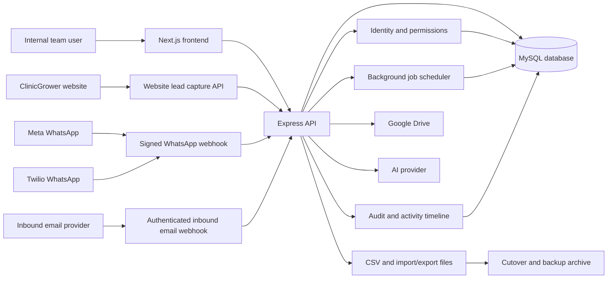

# Mission Control Architecture Diagram

This diagram shows the main runtime boundaries for Mission Control and the external systems it integrates with.

## Boundary Notes

- The frontend does not connect directly to the database or provider APIs.
- The backend owns authentication, authorization, workspace scope and provider validation.
- The database stores Mission Control records, audit history, communication history, scheduler state and source identifiers.
- Google Drive remains the source of file and folder content. Mission Control stores validated links and metadata.
- Website, WhatsApp and email inbound flows must map into a workspace before records are created.
- AI support is an assistant layer. Human approval, guardrails and audit history remain part of the CRM workflow.

## Release Notes

- Frontend, backend, database migrations and provider settings must be traceable in release records when they depend on each other.
- Provider credentials and webhook URLs are environment concerns and must not be hard-coded.
- Background jobs are in-process for the current release model. Multi-instance scheduling needs a database lock or external queue before being enabled on more than one process.
